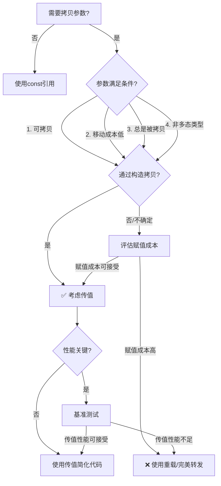

# 条款41：可拷贝、移动成本低且总是被拷贝的参数，考虑传值

## 核心思想

在C++11/14中，对于满足特定条件的函数参数，**传值（pass by value）** 可以成为一种简洁高效的替代方案，避免重载和完美转发带来的复杂性。本条款详细分析了这种策略的适用条件、性能表现和潜在陷阱。

---

## 1. 问题背景

在C++中，当函数需要拷贝其参数时，传统上有两种实现方式：

### 1.1 重载左值和右值引用
```cpp
class Widget {
public:
    // 左值版本：拷贝
    void addName(const std::string& newName) {
        names.push_back(newName);
    }
    
    // 右值版本：移动
    void addName(std::string&& newName) {
        names.push_back(std::move(newName));
    }
    
private:
    std::vector<std::string> names;
};
```

**缺点**：
- 代码重复：两个函数做基本相同的事情
- 维护成本：需要维护两个函数
- 目标代码膨胀：可能产生两个函数实例

### 1.2 使用万能引用
```cpp
class Widget {
public:
    template<typename T>
    void addName(T&& newName) {  // 万能引用
        names.push_back(std::forward<T>(newName));  // 完美转发
    }
};
```

**缺点**：
- 必须在头文件中实现
- 可能产生多个实例化版本
- 编译错误信息晦涩难懂
- 某些类型无法传递

---

## 2. 传值方案

### 2.1 基本实现
```cpp
class Widget {
public:
    // 单一函数，接收值参数
    void addName(std::string newName) {
        // 移动参数到容器中
        names.push_back(std::move(newName));
    }
    
private:
    std::vector<std::string> names;
};
```

### 2.2 关键观察
1. **参数`newName`是独立的**：无论传入左值还是右值，`newName`都是函数内的局部对象
2. **`std::move`的使用合理**：`newName`是最后一次使用，移动不会影响调用者
3. **自动区分左值/右值**：
   - 传入左值：调用拷贝构造函数初始化`newName`
   - 传入右值：调用移动构造函数初始化`newName`

### 2.3 使用示例
```cpp
Widget w;
std::string name = "Alice";

// 传入左值：拷贝构造 + 移动
w.addName(name);

// 传入右值：移动构造 + 移动
w.addName(name + " Smith");

// 传入字面量：移动构造 + 移动
w.addName("Bob");
```

---

## 3. 性能分析

### 3.1 操作次数对比
| 参数类型 | 重载版本 | 万能引用 | 传值版本 |
|---------|---------|---------|---------|
| **左值** | 1次拷贝 | 1次拷贝 | 1次拷贝 + 1次移动 |
| **右值** | 1次移动 | 1次移动 | 2次移动 |

### 3.2 成本分析
```cpp
// 假设传递 std::string
Widget w;
std::string longName = "SomeVeryLongName";

// 场景1：传递左值
w.addName(longName);
// 传值：1次拷贝（longName -> newName）+ 1次移动（newName -> names）
// 重载：1次拷贝（longName -> names）

// 场景2：传递右值
w.addName(std::move(longName));
// 传值：1次移动（longName -> newName）+ 1次移动（newName -> names）
// 重载：1次移动（longName -> names）
```

**关键点**：传值方案对左值多了一次移动操作，对右值也多了一次移动操作

---

## 4. 适用条件

### 4.1 参数必须可拷贝
```cpp
// ✅ 适合：std::string 可拷贝
void process(std::string data);

// ❌ 不适合：std::unique_ptr 不可拷贝
void setPtr(std::unique_ptr<int> ptr);  // 错误：unique_ptr 不可拷贝
```

**原因**：如果类型不可拷贝，重载版本只需要一个右值引用重载，而传值版本需要两次移动操作。

### 4.2 移动操作必须成本低廉
```cpp
// ✅ 适合：小型POD类型
struct Point { double x, y, z; };
void usePoint(Point p);

// ✅ 适合：有高效移动语义的类型
void useString(std::string s);  // 假设使用小字符串优化

// ❌ 不适合：移动成本高的类型
struct LargeBuffer { char data[4096]; };
void useBuffer(LargeBuffer buf);  // 移动=拷贝，成本高
```

**经验法则**：移动操作应该比拷贝操作快一个数量级

### 4.3 参数总是被拷贝
```cpp
// ✅ 适合：总是被拷贝
void addToCache(std::string key) {
    cache[key] = getValue(key);
}

// ❌ 不适合：有时不被拷贝
void maybeAdd(std::string name) {
    if (isValid(name)) {           // 条件判断
        names.push_back(std::move(name));
    }
    // 即使不添加，name也被构造和析构了
}
```

**验证方法**：确保参数在所有代码路径上都被使用

### 4.4 通过构造而非赋值拷贝
```cpp
// ✅ 适合：通过构造拷贝
class Widget {
    void addName(std::string name) {
        // 通过构造拷贝
        names.push_back(std::move(name));
    }
    std::vector<std::string> names;
};

// ❌ 可能有问题：通过赋值拷贝
class PasswordManager {
    void changePassword(std::string newPwd) {
        // 通过赋值拷贝
        password = std::move(newPwd);  // 可能触发内存重新分配
    }
    std::string password;
};
```

**赋值问题**：赋值操作可能需要重新分配内存，而引用版本可能重用现有内存

---

## 5. 陷阱与注意事项

### 5.1 切片问题
```cpp
class Shape { /* 基类 */ };
class Circle : public Shape { /* 派生类，有额外数据 */ };

// ❌ 危险：会发生切片
void draw(Shape s) {  // 只拷贝基类部分
    s.render();
}

Circle circle;
draw(circle);  // 只拷贝了Shape部分，丢失了Circle的额外数据
```

**解决方案**：对于多态类型，总是使用引用或指针
```cpp
// ✅ 安全：不会切片
void draw(const Shape& s) {
    s.render();
}
```

### 5.2 链式调用的累积开销
```cpp
void validate(std::string input) { /* 传值 */ }
void process(std::string data) {   /* 传值 */
    validate(data);  // 再次传值，额外移动
    // 处理 data
}

void store(std::string value) {     /* 传值 */
    process(value);  // 再次传值，额外移动
    // 存储 value
}

// 调用：可能产生多次不必要的移动
std::string data = "test";
store(data);  // 可能产生多次移动操作
```

**最佳实践**：在调用链中保持一致的参数传递方式

### 5.3 与异常安全的交互
```cpp
class Database {
public:
    // 传值 + 强异常安全
    void updateRecord(int id, std::string newValue) {
        std::string oldValue = records[id];
        
        // 如果此处抛出异常，记录保持不变
        records[id] = std::move(newValue);
        
        // 提交更改
        logChange(id, oldValue, newValue);
    }
    
private:
    std::unordered_map<int, std::string> records;
};
```

**优势**：传值参数本身是异常安全的，因为它是独立的副本

---

## 6. 性能对比表

| 场景 | 重载版本 | 万能引用 | 传值版本 | 推荐方案 |
|------|---------|---------|---------|---------|
| 左值，小对象 | 1次拷贝 | 1次拷贝 | 1次拷贝 | 任意 |
| 左值，大对象 | 1次拷贝 | 1次拷贝 | 1次拷贝+1次移动 | 重载/万能引用 |
| 右值，小对象 | 1次移动 | 1次移动 | 2次移动 | 重载/万能引用 |
| 右值，大对象 | 1次移动 | 1次移动 | 2次移动 | 重载/万能引用 |
| 条件拷贝 | 0或1次操作 | 0或1次操作 | 总是1次操作 | 重载/万能引用 |
| 多态类型 | 安全 | 安全 | 切片危险 | 重载/万能引用 |
| 代码简洁性 | 差 | 中 | 优 | 传值 |

---

## 7. 决策流程图



---

## 8. 实际示例

### 8.1 适合传值的场景
```cpp
// 场景：小型配置结构体，总是被存储
struct Config {
    int timeout;
    std::string name;
    bool enabled;
};

class Service {
public:
    // ✅ 适合：Config可拷贝、移动成本低、总是被存储
    void updateConfig(Config config) {
        // 验证配置
        if (config.timeout <= 0) {
            throw std::invalid_argument("Invalid timeout");
        }
        
        // 存储配置
        currentConfig = std::move(config);
        applyConfig();
    }
    
private:
    Config currentConfig;
};
```

### 8.2 不适合传值的场景
```cpp
// 场景：大型数据块，可能不被使用
class DataProcessor {
public:
    // ❌ 不适合：大数据块，移动成本高
    void processIfNeeded(std::vector<double> data) {
        if (shouldProcess(data)) {  // 条件判断
            process(std::move(data));
        }
        // 即使不处理，data也被构造和析构
    }
    
private:
    std::vector<double> buffer;
};
```

---

## 9. 现代C++最佳实践

### 9.1 使用概念约束（C++20）
```cpp
// C++20：明确约束可拷贝且可移动的类型
template<typename T>
requires std::copyable<T> && std::movable<T>
class Container {
public:
    // 仅对合适类型使用传值
    void addElement(T element) {
        elements.push_back(std::move(element));
    }
    
private:
    std::vector<T> elements;
};
```

### 9.2 结合完美转发和传值
```cpp
class OptimizedContainer {
public:
    // 对小对象使用传值，对大对象使用完美转发
    template<typename T>
    void add(T&& value) {
        if constexpr (sizeof(T) <= 2 * sizeof(void*)) {
            // 小对象：传值
            addSmall(std::forward<T>(value));
        } else {
            // 大对象：完美转发
            addLarge(std::forward<T>(value));
        }
    }
    
private:
    void addSmall(std::string value) {
        smallItems.push_back(std::move(value));
    }
    
    template<typename T>
    void addLarge(T&& value) {
        largeItems.push_back(std::forward<T>(value));
    }
};
```

---

## 10. 总结

### 核心建议
1. **默认不传值**：在不确定时，优先使用重载或完美转发
2. **满足条件再考虑**：仅当参数满足所有条件时才考虑传值
3. **基准测试是关键**：性能敏感代码必须进行实际测试
4. **警惕切片问题**：多态类型永远不要传值

### 何时使用传值
- ✅ 参数类型可拷贝
- ✅ 移动操作成本低廉（通常O(1)）
- ✅ 参数总是被使用（无条件判断）
- ✅ 通过构造而非赋值进行拷贝
- ✅ 非多态基类类型
- ✅ 代码简洁性比极致性能更重要

### 何时避免传值
- ❌ 参数移动成本高
- ❌ 参数可能不被使用
- ❌ 通过赋值进行拷贝
- ❌ 涉及多态类型
- ❌ 性能是关键要求
- ❌ 在深层调用链中

### 最终决策框架
```cpp
// 决策助记符：CALM-S
// C - Copyable（可拷贝）
// A - Always copied（总是被拷贝）
// L - Low-cost move（移动成本低）
// M - Moved-from（移动后使用）
// S - Simple code（代码简化）

if (参数满足CALM条件 && 需要简化代码) {
    考虑传值();
} else {
    使用传统方法();
}
```

传值策略是C++工具箱中的一个有用工具，但并非万能解决方案。明智的程序员了解其优势和限制，在适当场景中使用它来平衡性能、安全性和代码可维护性。