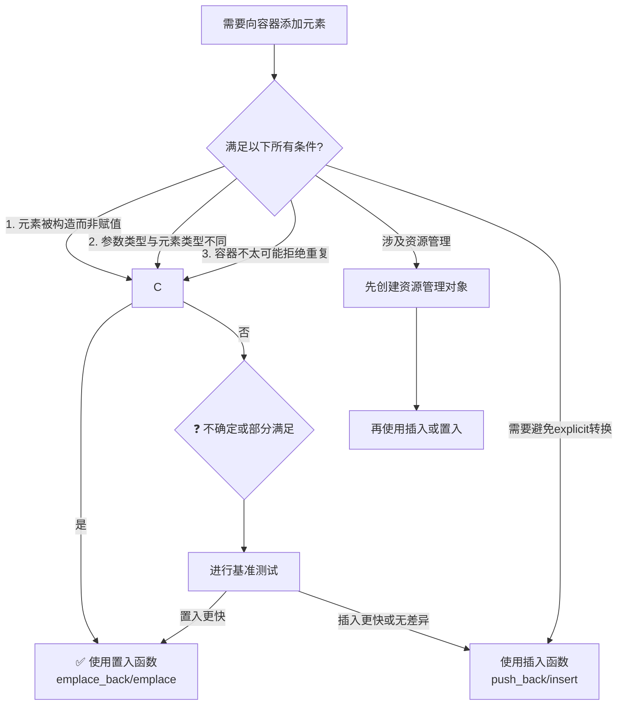

# 条款42：置入而非插入

## 概述

在C++11及以后的标准中，容器提供了`emplace`系列函数（如`emplace_back`、`emplace_front`、`emplace`），这些函数允许直接在容器内部构造元素，而不是先构造临时对象再插入。本条款详细分析置入函数与插入函数的区别，指导何时使用置入函数以获得最佳性能，并指出需要注意的陷阱。

## 核心概念

### 1. 插入函数的问题
```cpp
std::vector<std::string> vs;
vs.push_back("xyzzy");  // 问题：需要创建临时对象
```

**执行过程**：
1. 从字符串字面量`"xyzzy"`创建临时`std::string`对象
2. 临时对象被传递给`push_back`
3. 在`vector`内部通过移动或拷贝构造新元素
4. 临时对象被销毁

**性能问题**：额外创建和销毁了一个临时对象

### 2. 置入函数的解决方案
```cpp
std::vector<std::string> vs;
vs.emplace_back("xyzzy");  // 直接构造，无临时对象
```

**执行过程**：
1. 直接在`vector`的内存中构造`std::string`对象
2. 使用完美转发将参数`"xyzzy"`传递给构造函数

**优势**：避免了临时对象的创建和销毁

## 性能对比分析

### 1. 操作次数对比
| 操作 | `push_back("xyzzy")` | `emplace_back("xyzzy")` |
|------|----------------------|-------------------------|
| 构造次数 | 2次（临时对象+容器内对象） | 1次（容器内对象） |
| 析构次数 | 1次（临时对象） | 0次 |
| 移动次数 | 1次（临时对象到容器） | 0次 |

### 2. 复杂构造场景
```cpp
// 插入函数：需要显式创建对象
vs.push_back(std::string(50, 'x'));  // 创建临时对象，再插入

// 置入函数：直接传递构造参数
vs.emplace_back(50, 'x');  // 直接在容器内构造
```

## 置入函数的优势条件

### 1. 当值被构造而非赋值时
```cpp
// ✅ 适合：在末尾添加，构造新元素
std::vector<std::string> vs;
vs.emplace_back("new");  // 构造到末尾

// ❌ 不适合：在中间插入，可能导致赋值
vs.emplace(vs.begin(), "middle");  // 可能移动现有元素，而非构造
```

**经验法则**：
- `emplace_back`、`emplace_front`：通常是构造
- 在序列容器中间`emplace`：可能是赋值
- 节点式容器（`list`、`map`、`set`等）：总是构造

### 2. 当参数类型与容器元素类型不同时
```cpp
std::vector<std::string> vs;

// ✅ 适合：参数类型不同
vs.emplace_back("literal");  // const char* -> std::string
vs.emplace_back(50, 'x');    // int, char -> std::string

// ❌ 不适合：参数类型相同
std::string str = "existing";
vs.emplace_back(str);  // 与push_back(str)相同，无优势
```

### 3. 当容器不太可能拒绝重复值时
```cpp
std::set<int> unique_values;

// 检查值42是否已存在
unique_values.emplace(42);  // 需要先构造节点检查重复性

// 如果42已存在，构造的节点被销毁，浪费了构造/析构成本
```

**影响**：
- 对于不允许重复的容器（`set`、`map`、`unordered_set`、`unordered_map`）
- 当新值很可能已存在时，置入可能更低效
- 插入函数可以更早检测重复

## 重要陷阱与注意事项

### 1. 资源管理与异常安全
```cpp
std::list<std::shared_ptr<Widget>> widgets;

// ❌ 危险：可能泄漏资源
widgets.emplace_back(new Widget, customDeleter);
// 如果emplace_back在分配节点时抛出异常，new Widget的指针丢失

// ✅ 安全：先创建资源管理对象
auto sp = std::shared_ptr<Widget>(new Widget, customDeleter);
widgets.push_back(std::move(sp));
// 或
widgets.emplace_back(std::move(sp));
```

**问题根源**：
- 置入函数将资源获取（`new`）和资源管理对象构造分离
- 在这两个操作之间，如果发生异常，资源泄漏
- 插入函数要求先构造资源管理对象，更安全

**推荐实践**：
```cpp
// 最佳实践：使用独立语句创建智能指针
auto sp = std::make_shared<Widget>(args...);  // 或自定义删除器版本
container.push_back(std::move(sp));  // 或emplace_back
```

### 2. 显式构造函数与类型转换
```cpp
std::vector<std::regex> regexes;

// ❌ push_back：编译错误
regexes.push_back(nullptr);  // 错误：不能隐式转换nullptr到std::regex

// ✅ emplace_back：编译通过，但运行时错误！
regexes.emplace_back(nullptr);  // 编译通过，调用explicit构造函数
                                // 运行时：未定义行为（nullptr不是有效正则表达式）
```

**原因分析**：
- `std::regex`的`const char*`构造函数是`explicit`的
- `push_back`使用拷贝初始化，不允许`explicit`转换
- `emplace_back`使用直接初始化，允许`explicit`转换

**类似问题**：
```cpp
class ExplicitType {
public:
    explicit ExplicitType(int) {}
};

std::vector<ExplicitType> vec;
// vec.push_back(42);      // 编译错误
vec.emplace_back(42);       // 编译通过，可能不是期望的行为
```

## 性能评估指南

### 1. 决策流程图


### 2. 启发式检查表
| 条件 | 适合置入 | 适合插入 | 备注 |
|------|---------|---------|------|
| 在容器末尾/开头添加 | ✅ | ⚠️ | 置入通常构造，插入可能构造 |
| 参数类型不同 | ✅ | ❌ | 置入避免临时对象 |
| 参数类型相同 | ⚠️ | ✅ | 无差异，插入更清晰 |
| 容器拒绝重复的可能性高 | ❌ | ✅ | 插入可避免不必要的构造 |
| 涉及资源管理 | ❌ | ✅ | 插入更安全 |
| 需要避免意外explicit转换 | ❌ | ✅ | 插入提供编译时检查 |
| 代码可读性重要 | ⚠️ | ✅ | 插入意图更清晰 |

## 实际应用示例

### 示例1：高效构造复杂对象
```cpp
class Employee {
public:
    Employee(std::string name, int id, Date hireDate)
        : name_(std::move(name)), id_(id), hireDate_(hireDate) {}
    
private:
    std::string name_;
    int id_;
    Date hireDate_;
};

std::vector<Employee> employees;

// 传统插入：需要创建临时Employee对象
employees.push_back(Employee("Alice", 101, Date(2020, 1, 1)));

// 置入：直接传递构造参数
employees.emplace_back("Bob", 102, Date(2021, 3, 15));
```

### 示例2：多参数构造
```cpp
std::vector<std::pair<int, std::string>> pairs;

// 传统插入
pairs.push_back(std::make_pair(1, "one"));
pairs.push_back(std::pair<int, std::string>(2, "two"));

// 置入：更简洁
pairs.emplace_back(3, "three");
pairs.emplace_back(4, "four");
```

### 示例3：容器嵌套
```cpp
std::map<int, std::vector<std::string>> data;

// 传统插入：复杂
data[1].push_back("first");
data[1].push_back("second");

// 置入：可一步完成
data.emplace(2, std::vector<std::string>{"alpha", "beta"});
```

## 现代C++最佳实践

### 1. 通用建议
```cpp
template<typename Container, typename... Args>
void addToContainer(Container& c, Args&&... args) {
    // 通用函数：根据条件选择插入或置入
    if constexpr (/* 满足置入条件 */) {
        c.emplace_back(std::forward<Args>(args)...);
    } else {
        c.push_back(typename Container::value_type(std::forward<Args>(args)...));
    }
}
```

### 2. 异常安全包装
```cpp
template<typename Container, typename... Args>
void safeEmplace(Container& c, Args&&... args) {
    // 对于可能抛出异常的类型，提供强异常保证
    typename Container::value_type temp(std::forward<Args>(args)...);
    c.push_back(std::move(temp));
}
```

### 3. 基准测试框架
```cpp
#include <chrono>
#include <iostream>

template<typename Func>
void benchmark(const std::string& name, Func&& func, int iterations = 1000) {
    auto start = std::chrono::high_resolution_clock::now();
    
    for (int i = 0; i < iterations; ++i) {
        func();
    }
    
    auto end = std::chrono::high_resolution_clock::now();
    auto duration = std::chrono::duration_cast<std::chrono::microseconds>(end - start);
    
    std::cout << name << ": " << duration.count() / iterations 
              << " μs per iteration\n";
}

// 使用示例
void testPushBack() {
    std::vector<std::string> v;
    v.push_back("test");
}

void testEmplaceBack() {
    std::vector<std::string> v;
    v.emplace_back("test");
}

int main() {
    benchmark("push_back", testPushBack, 10000);
    benchmark("emplace_back", testEmplaceBack, 10000);
    return 0;
}
```

## 不同类型容器的具体建议

### 1. 序列容器
| 容器 | 推荐操作 | 说明 |
|------|---------|------|
| `std::vector` | `emplace_back` | 末尾添加通常构造 |
| `std::deque` | `emplace_back`/`emplace_front` | 两端添加通常构造 |
| `std::list` | `emplace_back`/`emplace_front`/`emplace` | 节点容器，总是构造 |
| `std::forward_list` | `emplace_after` | 节点容器 |

### 2. 关联容器
| 容器 | 推荐操作 | 说明 |
|------|---------|------|
| `std::set`/`multiset` | 根据重复可能性选择 | 高重复可能性时用`insert` |
| `std::map`/`multimap` | 根据重复可能性选择 | 高重复可能性时用`insert` |
| `std::unordered_set`/`map` | 根据重复可能性选择 | 同有序版本 |

### 3. 适配器容器
| 容器 | 备注 |
|------|------|
| `std::stack` | 无置入操作，使用底层容器的`push_back` |
| `std::queue` | 无置入操作，使用底层容器的`push_back` |
| `std::priority_queue` | 无置入操作，使用底层容器的`push_back` |

## 总结与最终建议

### 1. 黄金法则
1. **默认使用置入**：当不确定时，置入通常不会比插入更差
2. **满足三个条件时强烈推荐置入**：
   - 元素被构造到容器中
   - 传递的参数类型与容器元素类型不同
   - 容器不太可能因重复而拒绝新值
3. **特殊情况使用插入**：
   - 涉及资源管理（智能指针）
   - 需要避免意外的`explicit`构造函数调用
   - 代码清晰性比微小性能提升更重要

### 2. 性能调优流程
```
1. 编写可读、正确的代码
2. 识别性能关键路径
3. 在关键路径上测试插入vs置入
4. 根据测试结果选择
5. 添加注释说明选择原因
```

### 3. 代码示例：综合决策
```cpp
void addElements(std::vector<std::string>& vec, 
                 const std::string& existingStr,
                 const char* newLiteral) {
    
    // 情况1：已有对象 - 插入更清晰
    vec.push_back(existingStr);
    
    // 情况2：字符串字面量 - 置入更高效
    vec.emplace_back(newLiteral);
    
    // 情况3：多参数构造 - 置入更简洁
    vec.emplace_back(50, 'x');
}

void addResource(std::list<std::shared_ptr<Resource>>& resources) {
    // 资源管理：先构造智能指针
    auto resource = std::make_shared<Resource>(/* args */);
    
    // 然后插入（置入无优势，因为已有对象）
    resources.push_back(std::move(resource));
    // 或：resources.emplace_back(std::move(resource));
}

void addToSet(std::set<int>& numbers, int value, bool likelyDuplicate) {
    if (likelyDuplicate) {
        // 很可能重复：使用insert，避免不必要的节点构造
        numbers.insert(value);
    } else {
        // 很可能不重复：使用emplace
        numbers.emplace(value);
    }
}
```

### 4. 记住的关键点
1. 置入函数可以避免不必要的临时对象
2. 置入函数可能绕过`explicit`构造函数的保护
3. 置入函数在资源管理场景下可能不安全
4. 对于关联容器，重复可能性影响性能
5. 最终决策应基于实际基准测试

**最终建议**：理解置入函数的机制，明智地使用它们，在适当的情况下获得性能提升，同时避免潜在的陷阱。在性能关键代码中，总是进行基准测试来验证假设。