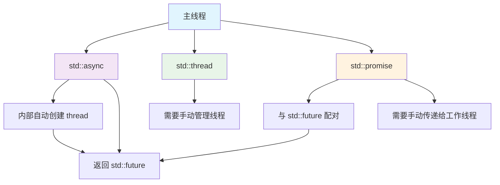

# C++并发编程四件套：thread, async, future, promise 详解

让我用一个生动的比喻来解释这四个组件的关系和区别：

## 🎯 核心比喻：餐厅后厨系统

想象一个餐厅的后厨工作流程：

| 概念 | 比喻 | 作用 |
|------|------|------|
| **`std::thread`** | 👨🍳 **厨师（工人）** | 实际干活的人 |
| **`std::async`** | 📋 **订单接收员** | 接收订单，安排工作 |
| **`std::promise`** | 📝 **订单单** | 记录顾客的菜品需求 |
| **`std::future`** | 🎫 **取餐号** | 顾客凭此取餐 |

## 1. 各自是什么？

### 1.1 `std::thread` - 线程（厨师）

**本质**：操作系统线程的封装
```cpp
#include <thread>
#include <iostream>

void cook_dish(const std::string& dish_name) {
    std::cout << "厨师开始做: " << dish_name << std::endl;
    std::this_thread::sleep_for(std::chrono::seconds(2));
    std::cout << dish_name << " 做好了!" << std::endl;
}

int main() {
    // 创建线程（雇厨师）
    std::thread chef(cook_dish, "鱼香肉丝");
    
    // 主线程继续做其他事
    std::cout << "前台继续接待顾客..." << std::endl;
    
    // 等待线程完成（等厨师做完）
    chef.join();
    
    return 0;
}
```

**特点**：
- 直接控制线程
- 需要手动管理生命周期（join/detach）
- 不直接返回值
- 线程间通信需要额外机制

### 1.2 `std::promise` 和 `std::future` - 承诺和未来（订单和取餐号）

这是一对**通信工具**，用于线程间传递结果。

#### `std::promise` - 承诺（下订单）
```cpp
#include <future>
#include <thread>
#include <iostream>

void cook_with_promise(std::promise<std::string> prom, 
                       const std::string& dish_name) {
    std::this_thread::sleep_for(std::chrono::seconds(2));
    prom.set_value(dish_name + " 做好了！");  // 完成承诺
}

int main() {
    // 创建承诺（下订单）
    std::promise<std::string> prom;
    
    // 获取未来结果（拿取餐号）
    std::future<std::string> fut = prom.get_future();
    
    // 开线程做菜（厨师开始做）
    std::thread chef(cook_with_promise, std::move(prom), "宫保鸡丁");
    
    // 等待结果（等叫号）
    std::cout << "等待菜品...\n";
    std::string result = fut.get();  // 阻塞直到有结果
    std::cout << "收到: " << result << std::endl;
    
    chef.join();
    return 0;
}
```

**`std::promise`**：生产端，承诺将来会提供值
**`std::future`**：消费端，将来获取值的凭证

### 1.3 `std::async` - 异步（自动化的订单系统）

**本质**：`thread + promise/future` 的高级封装
```cpp
#include <future>
#include <iostream>

std::string cook_dish_async(const std::string& dish_name) {
    std::this_thread::sleep_for(std::chrono::seconds(2));
    return dish_name + " 做好了！";
}

int main() {
    // 一步到位：自动创建线程，自动返回future
    std::future<std::string> fut = std::async(
        std::launch::async,  // 策略：立即创建线程
        cook_dish_async,     // 任务函数
        "麻婆豆腐"           // 参数
    );
    
    // 主线程可以继续做其他事
    std::cout << "前台继续工作...\n";
    
    // 需要结果时获取
    std::cout << fut.get() << std::endl;
    
    return 0;
}
```

## 2. 关系图解



## 3. 详细对比表格

| 特性 | `std::thread` | `std::async` | `std::promise`/`std::future` |
|------|---------------|--------------|-----------------------------|
| **创建线程** | 显式创建 | 隐式创建（可选） | 不创建线程，只用于通信 |
| **返回值** | 不支持直接返回 | 通过 `future` 返回 | 专门设计用于返回值 |
| **异常传递** | 不自动传递 | 自动传递到 `future` | 可通过 `set_exception` 传递 |
| **线程管理** | 手动 join/detach | 自动管理（通常） | 不管理线程 |
| **使用难度** | 中等 | 简单 | 复杂但灵活 |
| **适用场景** | 需要精细控制线程 | 简单的异步任务 | 复杂的线程间通信 |

## 4. 实际代码对比

### 4.1 相同功能的不同实现

**任务**：计算斐波那契数列，并返回结果

#### 方法1：只用 `std::thread`（原始方式）
```cpp
#include <thread>
#include <iostream>
#include <mutex>

std::mutex result_mutex;
long long result = 0;

void fibonacci_thread(int n) {
    if (n <= 1) {
        std::lock_guard<std::mutex> lock(result_mutex);
        result = n;
        return;
    }
    
    long long a = 0, b = 1;
    for (int i = 2; i <= n; ++i) {
        long long temp = a + b;
        a = b;
        b = temp;
    }
    
    std::lock_guard<std::mutex> lock(result_mutex);
    result = b;
}

int main() {
    std::thread t(fibonacci_thread, 10);
    
    t.join();
    
    // 需要全局变量和锁来获取结果
    std::cout << "Result: " << result << std::endl;
    return 0;
}
```

#### 方法2：用 `promise/future`（手动通信）
```cpp
#include <thread>
#include <future>
#include <iostream>

void fibonacci_promise(std::promise<long long> prom, int n) {
    if (n <= 1) {
        prom.set_value(n);
        return;
    }
    
    long long a = 0, b = 1;
    for (int i = 2; i <= n; ++i) {
        long long temp = a + b;
        a = b;
        b = temp;
    }
    
    prom.set_value(b);
}

int main() {
    std::promise<long long> prom;
    std::future<long long> fut = prom.get_future();
    
    std::thread t(fibonacci_promise, std::move(prom), 10);
    
    // 自动同步，无需锁
    std::cout << "Result: " << fut.get() << std::endl;
    
    t.join();
    return 0;
}
```

#### 方法3：用 `std::async`（最简单）
```cpp
#include <future>
#include <iostream>

long long fibonacci(int n) {
    if (n <= 1) return n;
    
    long long a = 0, b = 1;
    for (int i = 2; i <= n; ++i) {
        long long temp = a + b;
        a = b;
        b = temp;
    }
    return b;
}

int main() {
    // 一行代码搞定异步计算
    auto fut = std::async(std::launch::async, fibonacci, 10);
    
    // 继续做其他事情...
    std::cout << "计算中，可以继续处理其他任务...\n";
    
    // 需要结果时获取
    std::cout << "Result: " << fut.get() << std::endl;
    
    return 0;
}
```

## 5. 组合使用场景

### 5.1 复杂任务：多个线程协同工作
```cpp
#include <thread>
#include <future>
#include <vector>
#include <iostream>

// 多个线程并行计算，主线程收集结果
void parallel_computation() {
    const int num_threads = 4;
    std::vector<std::thread> threads;
    std::vector<std::promise<int>> promises(num_threads);
    std::vector<std::future<int>> futures;
    
    // 准备 futures
    for (auto& prom : promises) {
        futures.push_back(prom.get_future());
    }
    
    // 启动多个线程
    for (int i = 0; i < num_threads; ++i) {
        threads.emplace_back( {
            // 每个线程计算一部分
            std::this_thread::sleep_for(std::chrono::seconds(1));
            promises[i].set_value(i * 100);  // 模拟计算结果
        });
    }
    
    // 收集结果
    int total = 0;
    for (auto& fut : futures) {
        total += fut.get();
    }
    
    // 等待所有线程完成
    for (auto& t : threads) {
        t.join();
    }
    
    std::cout << "总计: " << total << std::endl;
}
```

### 5.2 使用 `std::async` 简化
```cpp
void parallel_computation_async() {
    const int num_tasks = 4;
    std::vector<std::future<int>> futures;
    
    // 启动多个异步任务
    for (int i = 0; i < num_tasks; ++i) {
        futures.push_back(std::async(std::launch::async,  {
            std::this_thread::sleep_for(std::chrono::seconds(1));
            return i * 100;
        }));
    }
    
    // 收集结果
    int total = 0;
    for (auto& fut : futures) {
        total += fut.get();
    }
    
    std::cout << "总计: " << total << std::endl;
}
```

## 6. 异常处理对比

### 6.1 `std::thread`：异常会终止程序
```cpp
void dangerous_operation() {
    throw std::runtime_error("出错了！");
}

int main() {
    std::thread t(dangerous_operation);
    
    try {
        t.join();
    } catch (...) {
        // 这里捕获不到！异常在线程内部
        std::cout << "无法捕获线程内的异常" << std::endl;
    }
    
    return 0;
}
// 程序会崩溃：terminate called after throwing an instance of 'std::runtime_error'
```

### 6.2 `std::async`/`std::future`：异常可安全传递
```cpp
int dangerous_async() {
    throw std::runtime_error("异步操作出错！");
    return 42;
}

int main() {
    auto fut = std::async(std::launch::async, dangerous_async);
    
    try {
        int result = fut.get();  // 异常在这里重新抛出
    } catch (const std::exception& e) {
        std::cout << "捕获到异常: " << e.what() << std::endl;
    }
    
    return 0;
}
```

### 6.3 `std::promise`：可手动传递异常
```cpp
void worker(std::promise<int> prom) {
    try {
        // 可能抛出异常的操作
        throw std::runtime_error("工作线程出错");
        prom.set_value(42);
    } catch (...) {
        // 捕获并传递异常
        prom.set_exception(std::current_exception());
    }
}

int main() {
    std::promise<int> prom;
    auto fut = prom.get_future();
    
    std::thread t(worker, std::move(prom));
    
    try {
        int result = fut.get();
    } catch (const std::exception& e) {
        std::cout << "主线程捕获: " << e.what() << std::endl;
    }
    
    t.join();
    return 0;
}
```

## 7. 生命周期管理

### 7.1 `std::thread` 的陷阱
```cpp
void bad_example() {
    std::thread t( {
        std::this_thread::sleep_for(std::chrono::seconds(1));
        std::cout << "线程工作完成\n";
    });
    
    // 忘记 join 或 detach！
    // 线程对象销毁时，如果线程还在运行，程序会终止
}  // 这里会调用 std::terminate()！
```

### 7.2 安全的使用模式
```cpp
// RAII 包装
class ThreadGuard {
    std::thread t;
public:
    template<typename Function, typename... Args>
    explicit ThreadGuard(Function&& f, Args&&... args)
        : t(std::forward<Function>(f), std::forward<Args>(args)...) {}
    
    ~ThreadGuard() {
        if (t.joinable()) {
            t.join();  // 或 t.detach()
        }
    }
    
    // 禁止拷贝
    ThreadGuard(const ThreadGuard&) = delete;
    ThreadGuard& operator=(const ThreadGuard&) = delete;
};
```

### 7.3 `std::async` 的生命周期
```cpp
void async_lifetime() {
    {
        // future 在作用域结束时析构
        // 如果任务未完成，会阻塞等待
        auto fut = std::async(std::launch::async,  {
            std::this_thread::sleep_for(std::chrono::seconds(2));
            std::cout << "任务完成\n";
        });
        
        std::cout << "future 即将析构...\n";
    }  // 这里会阻塞2秒，等待任务完成
    
    std::cout << "继续执行\n";
}
```

## 8. 选择指南

### 应该使用哪个？

| 场景 | 推荐工具 | 理由 |
|------|----------|------|
| **简单异步计算** | `std::async` | 最简单，自动管理 |
| **需要精细控制线程** | `std::thread` | 完全控制线程行为 |
| **复杂线程间通信** | `promise/future` | 灵活的通信机制 |
| **任务有返回值** | `std::async` 或 `promise/future` | 天然支持返回值 |
| **需要异常安全** | `std::async` 或 `promise/future` | 支持异常传递 |
| **线程池实现** | `std::thread` + `promise/future` | 需要底层控制 |
| **I/O密集型** | `std::async` 或 线程池 | 可创建更多线程 |

### 决策流程图

```
需要异步执行任务吗？
    ├─ 是 → 需要返回值吗？
    │      ├─ 是 → 使用 std::async (最简单)
    │      ├─ 否 → 需要精细控制线程吗？
    │      │      ├─ 是 → 使用 std::thread
    │      │      └─ 否 → 使用 std::async
    │      └─ 需要复杂通信吗？
    │             ├─ 是 → 使用 promise/future
    │             └─ 否 → 使用 std::async
    └─ 否 → 同步执行即可
```

## 9. 现代C++的演进

### C++20/23 的新特性
```cpp
// C++20: std::jthread (可连接线程，自动join)
#include <thread>

void cpp20_example() {
    std::jthread worker( {
        std::this_thread::sleep_for(std::chrono::seconds(1));
        std::cout << "工作完成\n";
    });
    
    // 自动join，无需手动管理
    std::cout << "主线程继续\n";
}

// C++23: std::async 的改进（提案中）
// 可能包含更好的取消支持、进度报告等
```

## 总结

**四者的本质关系**：

1. **`std::thread`** 是**基础** - 实际的执行单元
2. **`std::promise`/`std::future`** 是**通信机制** - 线程间的值传递管道
3. **`std::async`** 是**高级封装** - 自动化的任务执行器

**简单记忆**：
- 想简单：用 `std::async`
- 要控制：用 `std::thread`
- 要通信：用 `promise/future`
- 要灵活：组合使用

**一句话总结**：
`std::async` 是在 `std::thread` 基础上，用 `std::promise`/`std::future` 包装出来的高级接口，让异步编程变得更简单安全。