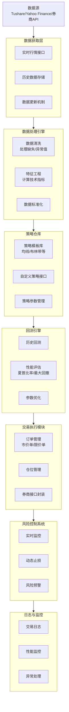
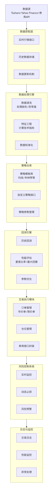

从零搭建一个量化交易系统是一项令人兴奋的挑战。下面我为你梳理了一个清晰、模块化的架构图，并详细解释每个核心组件，希望能为你提供一个坚实的起点。

为了让你对系统的全貌和数据流有一个直观的认识，我们先来看下面这张架构图。

---
## 从零搭建量化交易系统

### 核心模块详解与技术选型参考

以下是图中各核心模块的详细说明和实现思路。

#### 1️⃣ 数据获取层 (Data Layer)
这是系统的基础，负责获取高质量、低延迟的市场数据。
-   **功能**：从不同数据源获取实时行情和历史数据，并进行统一的存储管理。
-   **实现要点**：
    -   **多源接入**：设计一个抽象的数据接口，可以轻松切换不同的数据源。
    -   **本地存储**：强烈建议将数据持久化到本地数据库（如SQLite、MySQL或更专业的ClickHouse），以减少网络请求依赖，便于复杂分析。
    -   **定时更新**：设置定时任务，在非交易时间自动更新数据。

#### 2️⃣ 数据处理引擎 (Data Processing Engine)
原始数据无法直接使用，需要经过清洗和加工才能输入给策略模型。
-   **功能**：数据清洗、特征工程、技术指标计算。
-   **实现要点**：
    -   **数据清洗**：处理缺失值、异常值（如价格的毛刺跳动）。
    -   **特征工程**：计算各类技术指标（如均线、RSI、MACD），或构建基本面因子。可以使用 `ta` (Technical Analysis) 库来简化计算。
    -   **数据标准化**：为后续的机器学习模型准备数据。

#### 3️⃣ 策略仓库 (Strategy Repository)
这是量化交易系统的“大脑”，包含了所有的交易逻辑。
-   **功能**：策略的存储、管理、生成交易信号。
-   **实现要点**：
    -   **抽象基类**：定义一个策略抽象基类，规定所有策略必须实现的方法。
    -   **策略模板**：提供一些经典策略模板（如双均线交叉、布林带突破），方便快速开发。
    -   **参数管理**：将策略参数外部化，便于后续进行参数优化。

#### 4️⃣ 回测引擎 (Backtesting Engine)
在历史数据上模拟策略运行，是验证策略有效性的关键环节。
-   **功能**：模拟交易、计算绩效指标、参数优化。
-   **实现要点**：
    -   **避免未来函数**：确保在时间点 `t` 的策略逻辑只能使用 `t` 时刻及之前的信息。
    -   **考虑交易成本**：回测中必须考虑手续费、印花税和滑点，否则结果会过于乐观。
    -   **全面评估**：除了总收益，更要关注**夏普比率**、**最大回撤**、**胜率**等风险调整后收益指标。

#### 5️⃣ 交易执行模块 (Execution Module)
负责将策略产生的信号转化为真实的市场订单。
-   **功能**：订单管理、仓位跟踪、对接券商API。
-   **实现要点**：
    -   **订单生命周期管理**：妥善处理订单的提交、成交、部分成交、撤销等不同状态。
    -   **异常处理**：网络异常、订单拒绝等情况的容错和重试机制至关重要。
    -   **统一接口**：可以封装一个统一的交易接口，背后对接不同券商的API。

#### 6️⃣ 风险控制系统 (Risk Control System)
这是保证资金安全的“生命线”，防止因策略失效或市场极端波动造成灾难性损失。
-   **功能**：实时风险监控、动态止损、风险预警。
-   **实现要点**：
    -   **多层次风控**：包括单笔交易风控（如止损止盈）、单日总亏损风控、总资金回撤风控等。
    -   **实时性**：风控检查需要高优先级执行，一旦触发条件，应能立即中断交易。
    -   **预警机制**：通过邮件、短信等方式及时通知异常情况。

#### 7️⃣ 日志与监控 (Logging & Monitoring)
用于记录系统运行的全过程，便于复盘、调试和绩效分析。
-   **功能**：记录交易日志、监控系统状态、异常告警。
-   **实现要点**：
    -   **详细日志**：记录每一笔委托、成交、策略信号以及系统的关键状态变化。
    -   **可视化看板**：构建一个可视化面板，实时展示账户权益、持仓、盈亏等情况。
    -   **日志分析**：通过分析日志，可以找出策略的改进点和技术系统的优化方向。

### 💡 实现路径与关键建议

1.  **循序渐进**：不要试图一次性实现所有功能。建议从**数据获取 -> 回测引擎 -> 简单策略验证**这个最小闭环开始，逐步添加实盘交易、风控等模块。
2.  **技术选型**：**Python** 是主流选择，其生态拥有 `pandas` (数据处理), `backtrader`/`vectorbt` (回测), `ccxt` (加密货币交易) 等强大库支持。对于追求极致性能的部分，可考虑用 `C++` 重写。
3.  **警惕过拟合**：在策略研发中，避免在历史数据上过度优化参数，否则策略在未来很可能失效。可使用样本外测试来验证稳健性。
4.  **实盘与仿真的差异**：实盘交易必须考虑**滑点**、**流动性**、**订单排队**等仿真中难以完美模拟的因素，初期务必用小资金交易。

这个架构为你提供了一个坚实的蓝图。在实际开发中，你可以根据自身需求和交易品种（股票、期货、加密货币等）的特定规则，对模块进行增删和调整。