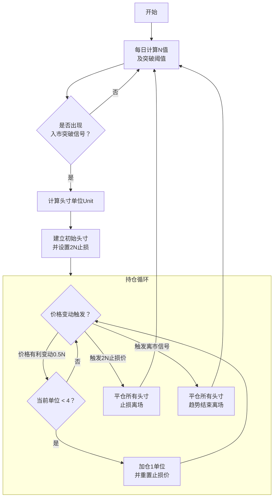

## 海龟交易策略技术文档

**文档版本：** 1.0
**最后更新日期：** 2023-10-27
**作者：** AI Assistant
**摘要：** 本文档详细说明了经典海龟交易策略的完整规则，包括市场选择、头寸规模计算、入市信号、离市信号和风险管理。该策略是一个纯粹的趋势跟踪系统。

---

### 1. 策略概述

#### 1.1 核心哲学
海龟交易策略是一种系统性的趋势跟踪策略。其核心哲学是：
*   **捕捉大趋势**：不预测市场顶部和底部，而是在趋势确立时入场，力求抓住价格移动的主要部分。
*   **截断亏损，让利润奔跑**：通过严格的止损控制小额亏损，通过趋势跟踪离市让盈利头寸持续增长。
*   **量化与纪律**：所有决策均基于固定规则，完全排除主观情绪干扰。

#### 1.2 关键概念：N值 / 平均真实波幅
N值是海龟策略风险管理的核心，代表资产的**每日波动性**。
*   **真实波幅** 计算如下：
    *   `TR = Max(当日最高价 - 当日最低价, |当日最高价 - 昨日收盘价|, |当日最低价 - 昨日收盘价|)`
*   **N值** 是过去20个交易日的真实波幅的简单移动平均：
    *   `N = (前19日的N * 19 + 当日的TR) / 20`
*   **初始计算**：对于数据的前20天，直接计算这20天TR的算术平均值。

---

### 2. 市场与时间框架

*   **交易品种**：高流动性的市场，如商品期货、主要外汇对、股指期货。
*   **时间框架**：日线图。所有计算基于日线数据。

---

### 3. 头寸规模管理

这是海龟策略最具特色的部分，旨在通过波动性使所有交易的风险敞口标准化。

1.  **计算美元波动性**：
    *   `DollarVolatility = N值 * 合约每点价值`
    *   *例如，原油N值为1.20，合约规格为1000桶/手，则DollarVolatility = 1.20 * $1000 = $1200*

2.  **计算单位规模**：
    *   规定账户总资产的1%对应一个N的波动。
    *   `Unit = (AccountSize * 1%) / DollarVolatility`
    *   *例如，账户规模为100,000美元。则1%为1000美元。`Unit = 1000 / 1200 ≈ 0.83`。四舍五入后，1个交易单位即为1手。*

3.  **头寸上限**：
    *   单一品种最大头寸为 **4个单位**。
    *   高度相关品种（如原油和汽油）的总头寸不超过 **6个单位**。
    *   多空方向总头寸（多头净额与空头净额之和）不超过 **10个单位**。

---

### 4. 入市信号

海龟系统使用两套独立的入市系统，建议同时运行以分散风险。

#### 4.1 系统一：短期系统（以20日突破为基础）

*   **做多信号**：当价格 **突破** 过去20个交易日的最高价时，入场做多。
*   **做空信号**：当价格 **跌破** 过去20个交易日的最低价时，入场做空。
*   **信号执行**：只要出现突破，无论之前方向如何，都严格按信号执行。

#### 4.2 系统二：长期系统（以55日突破为基础）

*   **做多信号**：当价格 **突破** 过去55个交易日的最高价时，入场做多。
*   **做空信号**：当价格 **跌破** 过去55个交易日的最低价时，入场做空。

#### 4.3 加仓规则（金字塔加码）

*   在初始头寸建立后，如果价格朝有利方向移动 **0.5个N**，则加仓1个单位。
*   **加仓间隔**：每次加仓都需在上次加仓价基础上再移动0.5个N。
*   **加仓上限**：每个品种最多加仓至 **4个单位**。
    *   *例如：在100元买入1单位，价格上涨0.5N至101元，加仓1单位；再上涨0.5N至102元，再加仓1单位。*

---

### 5. 止损规则

止损是生存的基石，必须无条件执行。

*   **统一止损幅度**：任何头寸（包括加仓头寸）的最大风险控制在 **2个N**。
*   **止损价计算**：
    *   **多头头寸止损价** = `入场价 - 2N`
    *   **空头头寸止损价** = `入场价 + 2N`
*   **组合头寸止损**：对于加仓后的多头头寸，止损价会随着价格的上涨而**上调**，但始终保持最新入场价下方2N的位置。这种“浮动止损”是锁定利润的关键。

---

### 6. 离市信号

离市信号与入市信号同样重要，它决定了何时退出盈利头寸。

*   **系统一离市**：
    *   **多头**：当价格 **跌破** 过去10日的最低价时，离场。
    *   **空头**：当价格 **升破** 过去10日的最高价时，离场。

*   **系统二离市**：
    *   **多头**：当价格 **跌破** 过去20日的最低价时，离场。
    *   **空头**：当价格 **升破** 过去20日的最高价时，离场。

*   **重要提示**：离市信号是针对**所有该品种头寸**的。一旦离市信号触发，无论该头寸是由哪个入市系统建立的，都应全部平仓。

---

### 7. 策略执行流程

以下流程图概括了策略的核心执行逻辑：

---

### 8. 回测与优化建议

*   **回测要点**：回测时应考虑**交易成本**和**滑点**。在流动性较差的市场，滑点影响会非常显著。
*   **参数敏感性**：20日/55日突破参数并非神圣不可侵犯。可根据不同市场特性进行微调，但应避免过度优化。
*   **心理准备**：该策略胜率通常低于50%，会经历频繁的小额亏损和较长的回撤期。**纪律性是成功的第一要素**。